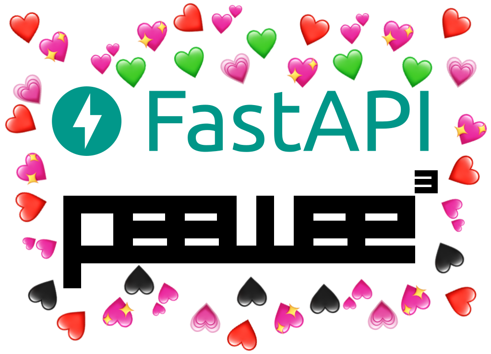

# FastAPIwee



<p align="center">
    <em>FastAPI + PeeWee = <3</em>
</p>

Made for [FastAPI web framework](https://fastapi.tiangolo.com) and [PeeWee ORM](http://docs.peewee-orm.com/en/latest/).

A fast and simple (I hope) way to create REST API based on PeeWee models.

## Requirements

Python 3.6+

- [FastAPI](https://fastapi.tiangolo.com)
- [Peewee](http://docs.peewee-orm.com/en/latest/)

## Installation

<pre class="termy">

```bash
$ pip install FastAPIwee

---> 100%
```

</pre>

## Example

### Prepare models

- Define Peewee models in example.py:

```python
import peewee as pw

DB = pw.SqliteDatabase('/tmp/fastapiwee_example.db')


class TestModel(pw.Model):
    id = pw.AutoField()
    text = pw.TextField()
    number = pw.IntegerField(null=True)
    is_test = pw.BooleanField(default=True)

    class Meta:
        database = DB


class AnotherModel(pw.Model):
    id = pw.AutoField()
    text = pw.TextField(default='Cucumber')

    class Meta:
        database = DB
```

### Add a dash of FastAPI

- Create FastAPI app and add CRUD APIs for models:

```python hl_lines="2-4 27-30"
import peewee as pw
from fastapi import FastAPI

from fastapiwee import AutoFastAPIViewSet

DB = pw.SqliteDatabase('/tmp/fastapiwee_example.db')


class TestModel(pw.Model):
    id = pw.AutoField()
    text = pw.TextField()
    number = pw.IntegerField(null=True)
    is_test = pw.BooleanField(default=True)

    class Meta:
        database = DB


class AnotherModel(pw.Model):
    id = pw.AutoField()
    text = pw.TextField(default='Cucumber')

    class Meta:
        database = DB


app = FastAPI()

AutoFastAPIViewSet(TestModel, app)
AutoFastAPIViewSet(AnotherModel, app, actions={'create', 'list'})
```

### Shake well and serve

- Start a server:

```bash
uvicorn example:app --reload
```

### Try it

- In your terminal, use curl:

Create a new shiny TestModel

<pre class="termy">

```bash
$ curl -i -X 'POST' \
>    'http://127.0.0.1:8000/test_model/' \
>    -d '{
>        "text": "Cucumber",
>        "number": 33,
>        "is_test": true
>    }'

HTTP/1.1 200 OK
date: Wed, 21 Apr 2021 07:20:23 GMT
server: uvicorn
content-length: 54
content-type: application/json

{"id":1,"text":"Cucumber","number":33,"is_test":true}
```

</pre>

Let's have one more

<pre class="termy">

```bash
$ curl -i -X 'POST' \
>    'http://127.0.0.1:8000/test_model/' \
>    -d '{"text": "Magic"}'

HTTP/1.1 200 OK
date: Wed, 21 Apr 2021 07:51:31 GMT
server: uvicorn
content-length: 53
content-type: application/json

{"id":2,"text":"Magic","number":null,"is_test":true}
```

</pre>

Let's see how they are doing. _(`python -m json.tool` is used to prettify JSON output)_

<pre class="termy">

```bash
$ curl -s -X 'GET' \
>    'http://127.0.0.1:8000/test_model/' \
>    | python -m json.tool

[
    {
        "id": 1,
        "is_test": true,
        "number": 33,
        "text": "Cucumber"
    },
    {
        "id": 2,
        "is_test": true,
        "number": null,
        "text": "Magic"
    }
]
```

</pre>

### Interactive API docs

Thanks to power of the FastAPI, you can go to [http://127.0.0.1:8000/docs](http://127.0.0.1:8000/docs).

You will see the automatic interactive API documentation (provided by [Swagger UI](https://github.com/swagger-api/swagger-ui)).

Or you can go to [http://127.0.0.1:8000/redoc](http://127.0.0.1:8000/redoc).

And see the alternative automatic documentation (provided by [ReDoc](https://github.com/Redocly/redoc)).

## License

This project is licensed under the terms of the MIT license.
